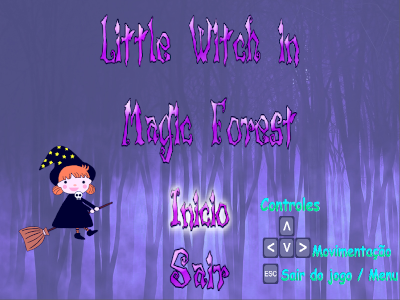
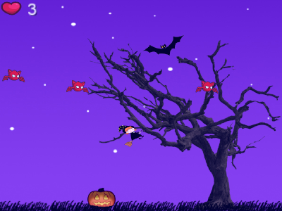
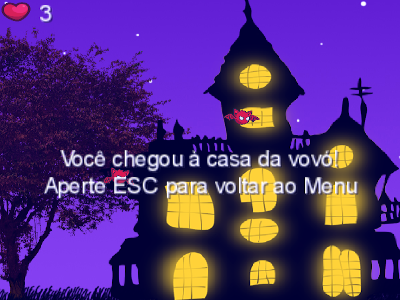

# Little Witch

* Jogo do gênero Plataforma
* Programado em Java com libGDX
* Arte e Som de terceiros
* Destaques:
    * Animações com sprite sheet
    * Física simples com aceleração, gravidade e detecção de colisão

* Requisitos:
  * Eclipse IDE instalado
  * Placa gráfica com suporte a OpenGL 3.3
    
* Instruções:
   * Abra o Eclipse IDE
   * Clique em File -> Open Projects from File System
   * No campo Import source coloque o caminho da pasta Little Witch Workspace, por exemplo: C:\Little-Witch\Little Witch Workspace
   * Clique em Finish e aguarde a sincronização (canto inferior direito do Eclipse).
   * No Eclipse, abra o arquivo localizado em desktop/src/me.gamepackage.desktop/DesktopLauncher
   * Clique em Run DesktopLauncher ou use o atalho Alt + Shift + X
   
* Imagens:

  
  
  

